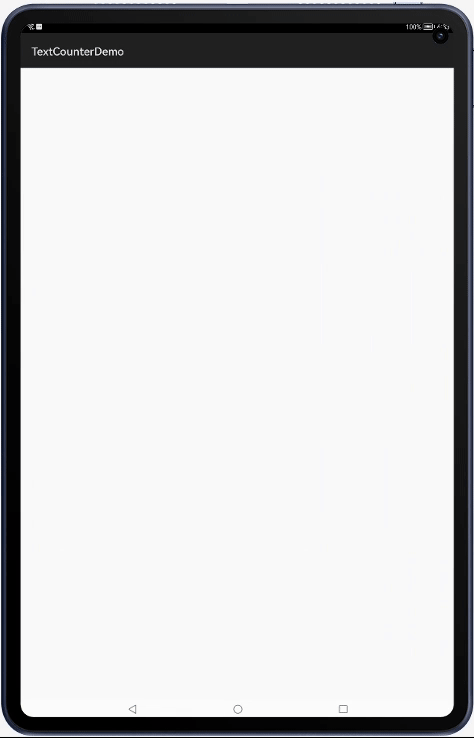

[](https://github.com/applibgroup/TextCounter/actions/workflows/main.yml)
[](https://sonarcloud.io/summary/new_code?id=applibgroup_TextCounter)

# TextCounter

A HMOS library which counts up/down of the text value.

## Source
Inspired by [premnirmal/TextCounter](https://github.com/premnirmal/TextCounter) - version 1.1.0

## Feature
A simple subclass of harmony's Text that counts up or down. Customize the counting using the attributes below.

See the demo project for more implementation details.



## Dependency
1. For using TextCounter module in sample app, include the source code and add the below dependencies in entry/build.gradle to generate hap/support.har.
```groovy
	dependencies {
		implementation project(':textcounter')
                implementation fileTree(dir: 'libs', include: ['*.har'])
                testImplementation 'junit:junit:4.13'
	}
```

2. For using TextCounter in separate application using har file, add the har file in the entry/libs folder and add the dependencies in entry/build.gradle file.
```groovy
	dependencies {
		implementation fileTree(dir: 'libs', include: ['*.har'])
		testImplementation 'junit:junit:4.13'
	}
```

3. For using textcounter from a remote repository in separate application, add the below dependencies in entry/build.gradle file.
``` groovy
         dependencies {
	         implementation 'dev.applibgroup:textcounter:1.0.1'
	         testCompile 'junit:junit:4.13'
         }
```

## Usage

#### Xml

```xml
   <com.github.premnirmal.textcounter.CounterView
        ohos:id="$+id:secondCounter"
        ohos:width="match_content"
        ohos:height="match_content"
        ohos:bottom_margin="20vp"
        ohos:text_size="30fp"
        ohos:text_color="$color:orange"
        counter:autoStart="true"
        counter:startValue="100"
        counter:endValue="5000"
        counter:incrementValue="10"
        counter:timeInterval="5"
        counter:prefix="$"
        counter:suffix=" moneys"
        counter:type="integer | decimal | both" />
```

#### Java
```java
 final CounterView counterView =
                (CounterView) findComponentById(ResourceTable.Id_secondCounter);
        counterView.setAutoFormat(false);
        counterView.setFormatter(new Formatter() {
            @Override
            public String format(String prefix, String suffix, float value) {
                return prefix + NumberFormat.getNumberInstance(Locale.US).format(value) + suffix;
            }
        });
        counterView.setAutoStart(false);
        counterView.setStartValue(200f);
        counterView.setEndValue(1000f);
        // the amount the number increments at each time interval
        counterView.setIncrement(5f); 
        // the time interval (ms) at which the text changes
        counterView.setTimeInterval(2);
        counterView.setPrefix("You have ");
        counterView.setSuffix(" points!");
        counterView.start(); // you can start anytime if autostart is set to false
```
#### Formatter
You can control the text formatting by providing a Formatter. Simply implement the interface `com.github.premnirmal.textcounter.Formatter` or use one of the formatters under the `com.github.premnirmal.textcounter.formatters` package.

#### License
MIT

